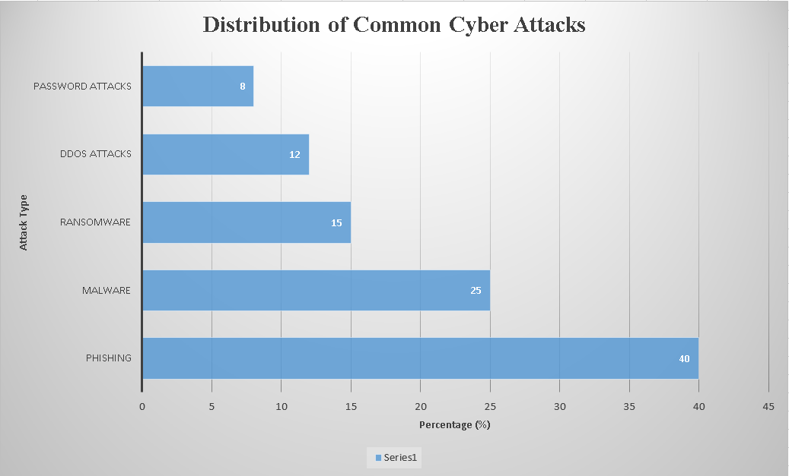

# <p align="center">🚀 Cyber Security: Technical Architectures, Emerging Threat Landscapes, and Strategic Mitigation Frameworks</p>

<p align="center">
  
  
  
</p>

---

# <p align="center">👨‍🏫 COURSE INSTRUCTOR</p>

<div align="center">
  <table speech-to-text="none">
    <tr>
      <td align="center" width="320px">
        <br />
        <sub><b>Tashreef Muhammad</b></sub><br />
        <span style="background-color: #6366f1; color: white; padding: 2px 8px; border-radius: 12px; font-size: 11px;"><b>Course Instructor</b></span><br><br>
        <a href="https://github.com/TashreefMuhammad"></a>
      </td>
    </tr>
  </table>
</div>

---

# <p align="center">👥 GENIUS GROUP MEMBERS</p>

<table speech-to-text="none" align="center">
  <tr>
    <td align="center" width="25%">
      <br />
      <sub><b>Taus Elham Tamjid</b></sub><br />
      <span style="background-color: #007acc; color: white; padding: 1px 6px; border-radius: 4px; font-size: 10px;"><b>👑 LEAD & DATA</b></span><br />
      <code>2026000000195</code><br><br>
      <a href="https://github.com/tauselhamtamjid"></a>
    </td>
    <td align="center" width="25%">
      <br />
      <sub><b>Ratul Ahmmed</b></sub><br />
      <span style="background-color: #28a745; color: white; padding: 1px 6px; border-radius: 4px; font-size: 10px;"><b>✍️ WRITER</b></span><br />
      <code>2026000000189</code><br><br>
      <a href="https://github.com/ratulahmmed21"></a>
    </td>
    <td align="center" width="25%">
      <br />
      <sub><b>Saif Ibn Rashid Tahsin</b></sub><br />
      <span style="background-color: #e11d48; color: white; padding: 1px 6px; border-radius: 4px; font-size: 10px;"><b>🛠️ GIT & DESIGN</b></span><br />
      <code>2026000000185</code><br><br>
      <a href="https://github.com/tahsin-eng"></a>
    </td>
    <td align="center" width="25%">
      <br />
      <sub><b>Sumaiya Akter Sayma</b></sub><br />
      <span style="background-color: #d97706; color: white; padding: 1px 6px; border-radius: 4px; font-size: 10px;"><b>🔍 RESEARCH</b></span><br />
      <code>2026000000205</code><br><br>
      <a href="https://github.com/sumaiyaaktersayma31"></a>
    </td>
  </tr>
</table>

---

# <p align="center">📖 TOPIC OVERVIEW</p>

The digital landscape features various security domains, emerging attack vectors, and mandatory defensive controls. This project categorizes foundational cyber security domains based on their operational architecture and threat exposure:
* **🛡️ Confidentiality, Integrity, & Availability (CIA Triad):** Core goals ensuring data is private, accurate, and accessible.
* **⚠️ Emerging Threat Landscape:** Analyzing modern vectors including phishing workflows and financial data breaches.
* **🧱 Strategic Defense Frameworks:** Establishing robust controls and administrative baselines to block malicious network intrusions.

---

## ⚙️ Project Workflow & Pipeline
<table speech-to-text="none">
  <tr>
    <td>
      <b>🛠️ Work Pipeline</b><br><br>
      ✅ <b>Planning:</b> Completed<br>
      ✅ <b>Research & Data:</b> In Progress<br>
      ❌ <b>Final Review:</b> Pending
    </td>
    <td>
      <b>📋 Execution Steps</b>
      <ol>
        <li>Read and analyzed core cyber security domains and recent attack data.</li>
        <li>Collected statistical distribution data of security threats.</li>
        <li>Generated customized data charts within Microsoft Excel to visualize attack distributions.</li>
        <li>Authored the definitive research report, assembled slides, and structured this GitHub workspace.</li>
      </ol>
    </td>
  </tr>
</table>

---

## 🤖 AI Usage Log

| 🤖 Tool Used | 🎯 Purpose | 💬 Example Prompt | 📦 Output Used | 🔧 Modification Done | ✅ Verification Method | 👤 Full Name |
| :--- | :--- | :--- | :--- | :--- | :--- | :--- |
| **Gemini & ChatGPT** | Concept research & formatting | "Explain CIA Triad and format markdown tables" | Technical reference & layout | Simplified text and added custom styles | Cross-checked manually | Taus Elham Tamjid |
| **ChatGPT** | Drafting theoretical sections | "Summarize cyber mitigation strategies" | Discussion base | Expanded and rewrote in academic tone | Compared with report | Ratul Ahmmed |
| **Grok** | Script & workflow structures | "Create folder architecture layout" | Directory tree design | Tailored to repository paths | Verified in repository | Saif Ibn Rashid Tahsin |
| **NotebookLM** | Analyzing raw research source | "Extract core stats from security data" | Statistical baseline | Paraphrased and structured text logs | Cross-checked with bibliography | Sumaiya Akter Sayma |

---

## 📊 Project Data Chart
Our Excel analysis provides a clear visual baseline of major cyber attack frequencies. Below is the data visualization generated from our repository dataset:

<p align="center">
  
</p>

---

## 🤝 Detailed Team Contribution Log
* **👤 Taus Elham Tamjid (2026000000195):** Authored introduction, structured major cyber threats data modeling, generated Microsoft Excel chart assets, and designed oral presentation templates.
* **👤 Ratul Ahmmed (2026000000189):** Compiled core theoretical discussion parameters, conducted cyber threat mitigation research, and assembled the final report documentation layout.
* **👤 Saif Ibn Rashid Tahsin (2026000000185):** Initialized and deployed the public GitHub workspace, organized directory paths, and crafted structural technical workflow diagrams.
* **👤 Sumaiya Akter Sayma (2026000000205):** Logged academic bibliography assets, managed strict reference indexing fields, and formulated mandatory AI usage documentation logs.

---

## 📁 Repository Directory Architecture
```text
├── 📂 excel/            -> Microsoft Excel dataset and source analysis files
├── 📂 images/           -> High-resolution workflow diagrams and data charts
├── 📂 presentation/     -> Presentation slides for oral team evaluation
├── 📂 report/           -> Assignment files deployed in Word and PDF layouts
└── 📄 README.md         -> Comprehensive workspace summary and project overview
